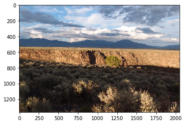
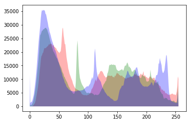

```python
from skimage import io
```


```python
import matplotlib.pyplot as plt
```


```python
import numpy as np
```


```python
def channel_splitter(image):
    '''fast numpy-based version, takes an image imported as numpy array and returns a graph with three channels histograms'''
    xaxis = np.arange(256) # create the x-axis between 0 and 255
    fig, ax = plt.subplots() # initiate plots
    for number, color in enumerate(['red', 'green', 'blue']): # creates pairs of channel number (0-2): color name
        freqcount, _ = np.histogram(image[:,:,number], bins = np.arange(257)) # gets the counts for each bin
        # must be one more bin as np.histogram returns bin edges (that is pixels with value 255 are in the bin 255-256)
        ax.fill_between(xaxis, 0, freqcount, facecolor = color, alpha = 0.3) 
        #makes a graph with the correct color for each channel, transparency set to 30%
    plt.show()
        
```


```python
image = io.imread('./my_notebooks/riogrande.jpg')
```


```python
plt.imshow(image)
```


    <matplotlib.image.AxesImage at 0x15c993e5be0>





```python
channel_splitter(image)
```




